# Jarvis OJ: PWN-level0

**source:** [Jarvis OJ](https://www.jarvisoj.com/challenges)
**Category:** Pwn
**Points:** 50
**Description:**

> nc pwn2.jarvisoj.com 9881
>
>[level0](https://dn.jarvisoj.com/challengefiles/level0.b9ded3801d6dd36a97468e128b81a65d)

## Write-up
### 1. challenge description
简单的一道pwn题，可以尝试运行一下<br>
>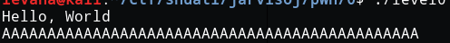

### 2. vulnerabilities
在ida64中分析源码，不难发现是栈溢出
#### 2.1 栈溢出点
>在函数列表中看到下面两个值得注意的函数vulnerable\_function()和callsystem()：<br>
>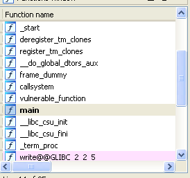<br>

>分析vulnerable\_function()缓冲区buf的长度只有`0x80`，而read()读入的长度却有`0x200`，可以覆盖buf，达到栈溢出的效果<br>
>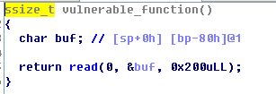<br>

>另外callsystem()这个函数可以直接用上：<br>
>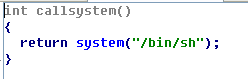<br>

>顺便再利用peda的checksec看一下，nice，只开了nx(堆栈不可执行)对本题不会有影响，妥妥的babypwn\_(:зゝ∠)_ <br>
>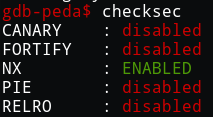

#### 2.2 利用思路
>`call vulnerable_function()`之后栈的分布如下，执行完毕之后，跳转到`rip`所指向的指令（即call的下一句）
>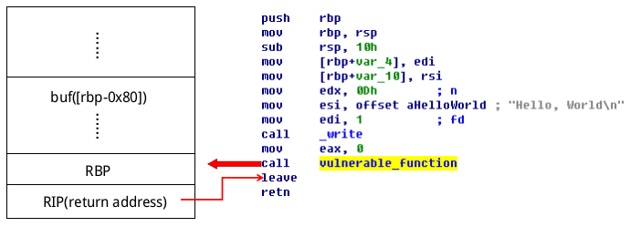
>
>所以我们只要用`callsystem()`函数的入口地址`覆盖掉rip`，执行完vulnerable\_function()后，就会跳转到callsystem（）了。
>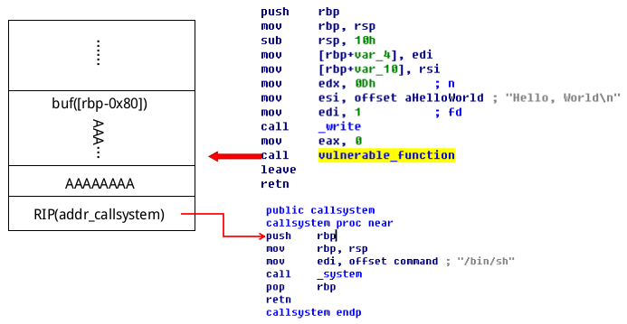

### 3. exploit
基础栈溢出有一个基本问题，如何确定缓冲区的长度，一般会考虑采用下面三种方式：

#### 3.1 ida中观察
>根据`bp-80h`加上rbp(8字)确定缓冲区的长度为`0x80+8`
>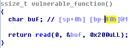<br>
>但是有些情况下ida的bp-xx在实际执行中并不准确，因此要考虑其他做法

#### 3.2 动态调试
>动态调试过程中，看函数执行时为缓冲区开辟了多大的空间

#### 3.3 借助peda
>利用gdb的插件`peda`来确定缓冲区长度
1. 先创建一段长度比预计缓冲区长度要长的pattern，`pattern_create 200`此处创建长度为200的pattern<br>
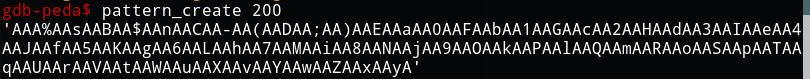
2. r运行程序，输入刚才创建的pattern，程序溢出后观察栈，记录下`ebp`内容`0x6c41415041416b41`
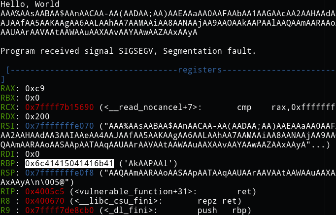<br>
3. 利用`pattern offset 0x6c41415041416b41`得出缓冲区长度为`128`
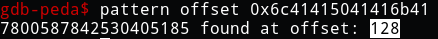<br>

### 4. python脚本编写
#### 4.1 构造payload
```python
e = ELF('./level0')

#获取函数callsystem()的入口地址
addr_callsystem = p64(e.symbols['callsystem'])

#128 + 8：缓冲区长度+ebp长度(64位)
payload = (128 + 8) * 'A' + addr_callsystem
```

#### 4.2 代码地址
完整的脚本见`github`
* [level0.py](https://github.com/LevanaXr/WriteUps_for_CTF/tree/master/2017/jarvisoj/pwn/level0/level0.py)
