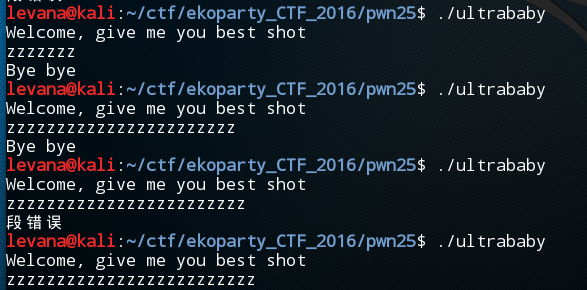

## EKOPARTY CTF  PWN25 Ultrababy

##### Ok, frankly I admit this problem is quite easy, but there are still many new things in it. As the strat of my binary study, it fits me well.
<br>
* Firstly, it is a ELF object, so I run it in Kali. The result is like the fllowing picture.</br>
  Enhen, try more. Then easy to know it is about 【<strong>Stack Smashing</strong>】.<br>
  So, at the point of transiation range from 23bytes-25bytes, the stack overflows.<br> 
  Now that we have known what it is about, the following path may be much smoother:)
   
   
  <br>
*  Then, I load it to IDA64. Wow, so many functions. <br>
   However, what we really care are only the Main(), Bye(), Flag(), Read().<br>
   Let us see, Flag()[strat at 0X00000000000007f3] is so close to Bye()[strar at 0X00000000000007e0].
   
   
   <br>
*  Maybe Assembly language is troublesome for many newcomers. So I convert is to ultrababy.c.<br>
   The C program is easier to understand, let's start from it. But I will also figure the assembly out, which it is clearer in a long term.<br>
   
   <br>
   <br>
### Version C
   

* Then look back Picture1, we will know the buffer is 24bytes【!!why it's not 23 bytes? I will explain later】<br>
  At once the input is over 24bytes, it will overflow to the memory of V6, which originally stores the start address of Function Bye().<br>
  If we make the overflow accurately to the memory of V6 and accurately the start address of Function Flag() replace the start address of Function Bye(). WE WILL　SUCCESS!
  <br>
  <br>
### Version Assembly
  

* Look at the above picture, enhen, I guess you will be clear aha~<br>


<br>

* So we input 24 "x"s + '\xf3'【take from the strat address of Flag() 0X00000000000007f3】,it will overflow accurately to the memory stored the start adress of Bye() and rewire it~
   

<br>
### Some questions

1. Why the buffer is 24bytes but overflow will happen at input 24characters???
 * Because after we input string, it will automaticlly be added '\0'(Null) at the end of the string to mark the end.
 
 
2. Why we can use '\xf3' repalce '0X00000000000007f3'
 * Because '0X00000000000007f3' and '0X00000000000007e0' are only different in '\xf3' and '\xe0'
 * Besides, although after we input string, it will automaticlly be added '\0'(Null) at the end of the string to mark the end, <strong>Null</strong> be added to '\xf3', But it doesn't matter, because '0X00000000000007f3' the last bytes of '\xf3' is '\x07', Null is 0, it replace the 0 of '\x07', doesn't matter.
 
 
<br>

### The Cause for the Vulnerability?

* It's obvious.
* This program don't check the the boundary of the buffer, so it's easy to cause <strong>Stack Smashing</strong>.
* Give very simple code for example【checked in Dev C++】:
  
  ```
  #include <stdio.h>
  
  int main()
  {
     char aha[1];
     aha[0] = 'a';
     printf("%s", aha);// if meet the '\0' in memory, the print will over,but it's random. if meet, we can rewrite it instead of '\0'.
     return 0;
  }
  
  
