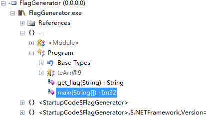
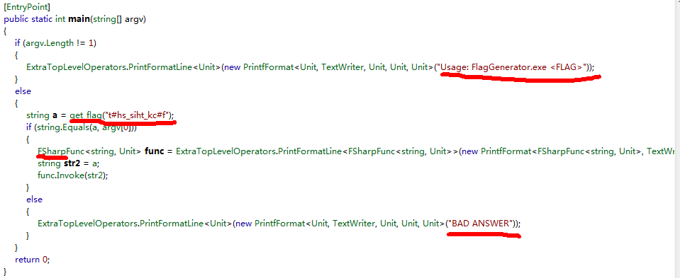
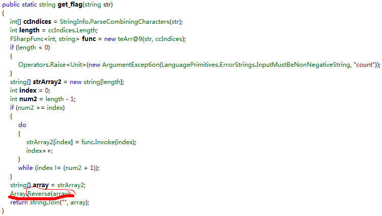
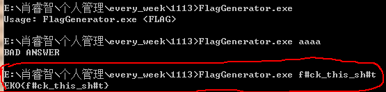

##EKOPARTY CTF Rev50 F#ck

 
* 一个.net程序，开始用IDA打开发现看不懂，遂知.NET程序不适合用IDA打开...
* 用.NET Relector 打开， 得到程序如图，根据关键信息，发现是f#代码。
* 看到两个关键函数，main和get_flag函数

 
* 看main函数中的关键句，调用get_flag函数： get_flag("t#hs_siht_kc#f");

 
* 看get_flag中的关键处理： Array.Reverse(array);
* 猜测是对字符串"t#hs_siht_kc#f"，进行反转得"f#ck_this_sh#t"

 
* 用"f#ck_this_sh#t"进行尝试，得到答案

