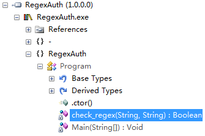
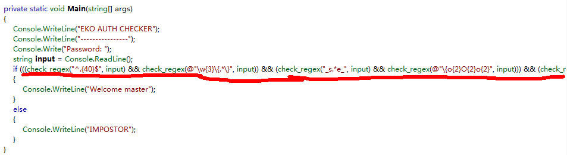
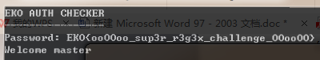

## EKOPARTY CTF Rev75 RrEeGgEeXx


* 依旧是一个.NET程序，在.NET Reflector中加载，看到两个关键函数，main和check_regex
<br>

<br>
<br>

* 查看main函数，关键信息为if语句

<br>
<br>

* 细看一下if语句，尤其是其中的条件，正则表达式regex
* 因为程序中没有任何地方提到flag，所以猜测满足if语句中的正则表达式结果即为flag<br>

```
if (((check_regex("^.{40}$", input) && check_regex(@"\w{3}\{.*\}", input)) && (check_regex("_s.*e_", input) && check_regex(@"\{o{2}O{2}o{2}", input))) && (check_regex(@"O{2}o{2}O{2}\}", input) && check_regex("sup3r_r3g3x_challenge", input)))
    {
        Console.WriteLine("Welcome master");
    }
```
<br>

* 正则表达式要求
    1. "^.{40}$" 要求字符串长40
    2. @"\w{3}\{. * \}" 前面三个字母，后面要有{}， 猜测为EKO{}
    3. "_s. * e_"  要求 _ s后面的字符串后面还要接有 _ e   
    4.  @"\{o{2}O{2}o{2}" 要求大括号{后面是ooOOoo，即{ooOOoo开头
    5.  @"O{2}o{2}O{2}\}" 要求OOooOO在大括号}前面，即OOooOO}结尾
    6.  "sup3r_r3g3x_challenge" 要求包含sup3r_r3g3x_challenge，其实利用这一条构造 _ sup3r_r3g3x_challenge _ 这一条就满足了3的要求了

<br>
* 构造出答案为EKO{ooOOoo _ sup3r_r3g3x_challenge _ OOooOO}，检测一下正确性

* Bingo~~
